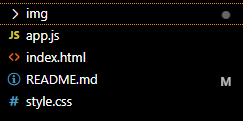

# Índice
   - [trabalho de recuperação - Landing Page ](#trabalho-de-recupera%C3%A7%C3%A3o----lan-page)  
   - [Descrição](#descri%C3%A7%C3%A3o)  
   - [Introdução](#introdu%C3%A7%C3%A3o)  
   - [Funcionalidades](#funcionalidades)
   - [codigos](#codigos)
   - [Tecnologias Utilizadas](#tecnologias-utilizadas)  
   - [Fontes Consultadas](#fontes-consultadas)  
   - [Autores](#autores)  

# trabalho de recuperação -  Landing Page 🚀

   
## DESCRIÇÃO📜
criar uma página do tipo Landing page para um novo negócio que está abrindo na Saul Elkind, uma cafeteria. A ideia é oferecer promoções e anunciar os produtos e serviços desse novo negócio aos potenciais consumidores da região. A empresa usará sua landing page para divulgar o início das operações do negócio pelo instagram institucional.

## Introdução📖
O objetivo desta landing page é divulgar informações atrativas e relevantes sobre o novo negócio na Saul Elkind, criando um ambiente online que destaca as promoções, produtos e serviços oferecidos pela cafeteria.

## Funcionalidades⚙️
°Página inicial apresentando informações sobre a cafeteria.  
°Destaque para promoções para atrair a atenção dos clientes.    
°Seção dedicada a mostrar os produtos e serviços oferecidos pela cafeteria.    
°Links de navegação para facilitar o acesso às diferentes seções da página.   
i°ncentivando os visitantes a conhecerem mais sobre os produtos.     

## CODIGOS🦾

**index.html:** Este arquivo é a página principal da aplicação, contendo a estrutura HTML e referências aos estilos e scripts necessários.

**style.css:** Arquivo CSS responsável pelo estilo e layout da página.

**app.js:** Arquivo JavaScript que controla a funcionalidade do modo claro/escuro.

**/img:** Pasta contendo imagens utilizadas na página.

### Tecnologias Utilizadas🌐
°HTML5    
°CCS3       
°JS   

## Fontes Consultadas🔍
[Inteligência Artifcial](https://chat.openai.com/)     
[youtube](https://youtu.be/RaITAxEdTDY?si=SYE6ZOLW1EYN8arR)       
[répositorio github](https://gist.github.com/lohhans/f8da0b147550df3f96914d3797e9fb89)    

## Autores🥷
 [Leonardo de Oliveira](https://github.com/leoOliveiraBR)
